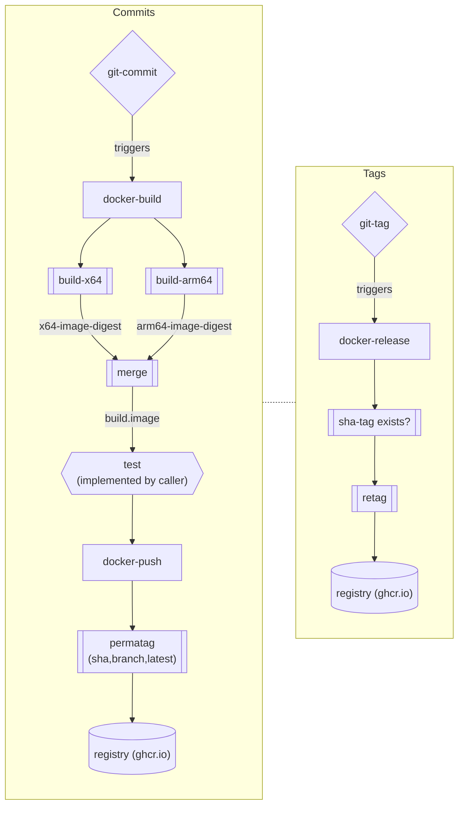

# Berkeley Library: Shared GitHub Actions Workflows

Shared workflows for Berkeley Library GitHub repositories.

## Docker Workflows

Reusable `workflow_call` workflows for multi-arch (ARM64/x64) Docker image
CI/CD. Calling repos compose these stages in their own workflows.

### CI Pipeline

The CI pipeline builds, tests, and pushes images on every branch push. The
[`docker-ci` workflow template](workflow-templates/docker-ci.yml) demonstrates
how to weave together the shared build and push workflows with a custom test
job.

| Workflow | Inputs | Outputs | Purpose |
|----------|--------|---------|---------|
| [`docker-build`](.github/workflows/docker-build.yml) | `image` | `image`, `image-arm64`, `image-x64` | Build on native ARM64 + x64 runners, merge into a multi-platform manifest with a temporary build tag |
| [`docker-push`](.github/workflows/docker-push.yml) | `image`, `build-image-arm64`, `build-image-x64` | — | Retag the build digests with permanent tags (`sha-*`, branch name, `latest` on default branch) |

The **test** job is defined by the calling repo (not a shared workflow) so each
project can customize its test setup. The `docker-ci` template provides a
starting point that pulls the built image via `docker compose` and runs a `test`
command in the app container.

### Release Pipeline

The release pipeline runs on git tags. It finds the existing `sha-*` image
(previously pushed by CI) and retags it with semver tags — no rebuild required.

| Workflow | Inputs | Outputs | Purpose |
|----------|--------|---------|---------|
| [`docker-release`](.github/workflows/docker-release.yml) | `image` | — | Retag the `sha-*` image with version tags (`v1`, `v1.2`, `v1.2.3`, full tag) |

---

> **Semver Suffixes:** The `docker/metadata-action@v5` `semver` tag type does not handle
> version suffixes (e.g. prerelease tags like `v1.2.3-rc.1`). The release
> workflow uses custom `match` regexes instead, ensuring that even suffixed
> versions are recognized and tagged at the major, minor, patch, and full tag
> levels.

---

> **Optional "v" Prefix:** docker-release allows but ignores a leading "v" on a semver
> tag. For example, the tags "v1.2.3" and "1.2.3" will both result in retagging
> the underlying image with "1", "1.2", and "1.2.3" (without the leading "v").

---

#### Example release workflow

```yaml
# .github/workflows/release.yml
name: Release

on:
  push:
    tags:
      - '**'
  workflow_dispatch:

jobs:
  release:
    uses: BerkeleyLibrary/.github/.github/workflows/docker-release.yml@main
    with:
      image: ghcr.io/${{ github.repository }}
    secrets: inherit
```

### Full Lifecycle



### Caller Requirements

- A `Dockerfile` at the repo root
- A `compose.yml` and `compose.ci.yml` for testing (if using the compose-based test pattern)
- `packages: write` permission on the calling workflow
- `secrets: inherit` on each reusable workflow call
